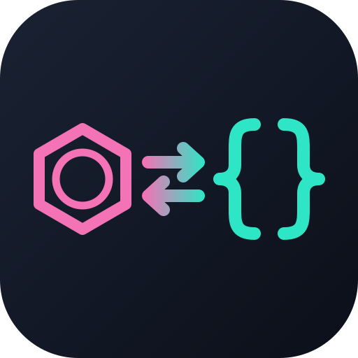
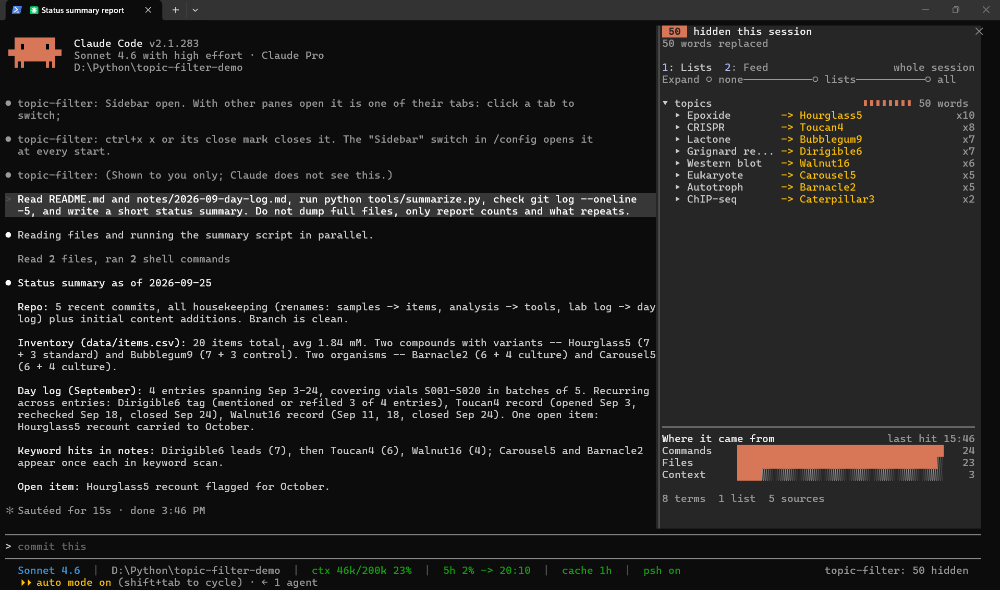
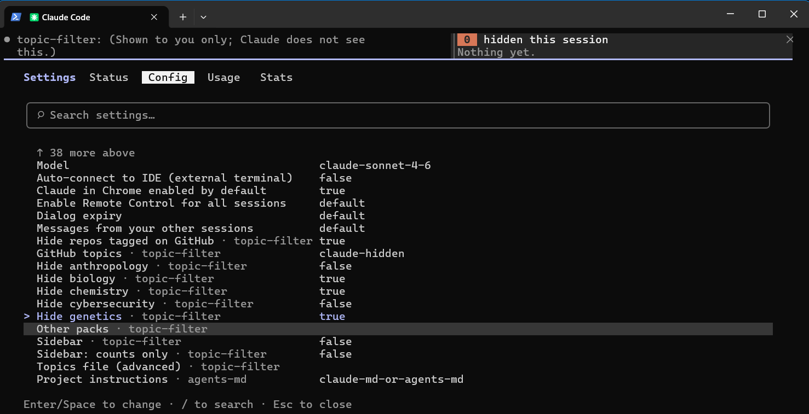

<p align="center">
  
</p>

# topic-filter-mod
Code with Claude without your past life tagging along. Chosen topics become neutral placeholders before Claude reads them; nothing on disk changes.

Your machine carries everything you have ever worked on: a career in
chemistry, a thesis, old side projects, a client's name. None of it has
anything to do with the bug you are fixing today, but Claude reads it anyway,
in file names, notes, memory and command output, and unrelated material pulls
a session sideways. You should be free to work on the code in front of you
without explaining your history first.

`topic-filter` is a [Claude Mod](https://github.com/anthropics/claude-code/tree/main/mods)
(a Claude Code plugin built on function hooks) that keeps chosen topics out of
the way. Before the model reads anything, each listed term becomes a stable
placeholder (`Teotihuacan` becomes `Teacup7`), or the lines that mention it
disappear. Your repos, notes and memory stay as they are.



*Claude answers in codenames; the sidebar, shown to you only, maps each one back
and counts where it was hidden. The dim `topic-filter: 50 hidden` sits in the
prompt footer.*

## Install

**1. Turn on function hooks.** They are early access. Add this to
`~/.claude/settings.json` (merge the key into an existing `env` block if you
have one):

```json
{ "env": { "CLAUDE_CODE_ENABLE_FUNCTION_HOOKS": "1" } }
```

**2. Install the plugin.** This repository is its own marketplace:

```
claude plugin marketplace add lperezmo/topic-filter-mod
claude plugin install topic-filter@topic-filter-mod
```

Or from inside Claude Code: `/plugin marketplace add lperezmo/topic-filter-mod`,
then `/plugin install topic-filter@topic-filter-mod`.

**3. Choose what to hide.** Run `/config` and type `topic-filter` to find the
plugin's rows. Enter or Space flips a switch or edits a field:



| Setting | Default | What it does |
| --- | --- | --- |
| Hide anthropology, biology, chemistry, cybersecurity, genetics | off | One switch per [built-in pack](#topic-packs) |
| Other packs | empty | Names of [your own packs](#topic-packs), comma-separated |
| Sidebar | off | Opens [the sidebar](#the-sidebar) at every start |
| Sidebar: counts only | off | The sidebar shows counts by list, never a word or file name |
| Extra words to hide | empty | Comma-separated words or names; kept in secure storage, not in `settings.json` |
| Topics file (advanced) | empty | Where [the topics file](#the-topics-file) lives, if you want one |

**Extra words to hide** is kept secret, so `/config` does not list it: set it
in `/plugin`: Installed, then `topic-filter`, then configure it. That screen
shows every setting as a text box; there, a switch takes the word `true` or
`false` (a `y` is saved as false).

What you type in either place goes to the plugin, never into the
conversation. A change applies right away, no restart needed. To hide a repo,
see [Hiding repositories](#hiding-repositories-without-deleting-them).

**4. Restart Claude Code** once after installing: sessions that were already
running do not load the plugin. The prompt footer then shows a dim
`topic-filter: M hidden` beside the other modes, `/topic-filter` shows what is set to be hidden and
where each part comes from, and `/topic-filter log` shows what was actually
hidden and where (both shown to you only).

The [topics file](#the-topics-file) is optional. Use it for what the settings
cannot express: drop-line or restore modes for your own words, several lists,
`exclude`. Write it yourself in an editor rather than asking Claude, since it
holds the words you are hiding. Its lists add to the settings'.

> Built and tested against Claude Code 2.1.282. The function hooks API may
> change between releases.

## Update

Claude Code does not update plugins from third-party marketplaces on its own
unless you turn that on. Pick one:

- **Automatic (recommended).** Once, in Claude Code: `/plugin`, then
  Marketplaces, then `topic-filter-mod`, then enable auto-update. New versions
  install when Claude Code starts.
- **By hand**, whenever you want the latest:

  ```
  claude plugin marketplace update topic-filter-mod
  claude plugin update topic-filter@topic-filter-mod
  ```

Either way, restart Claude Code afterwards; running sessions keep the old
version. `claude plugin list` shows the version you have. Updates never touch
your topics file or your own packs in `~/.claude/topic-filter/`.

To remove it: `claude plugin uninstall topic-filter@topic-filter-mod`. Your
topics file stays until you delete it.

## Using it

The motivating case: `gh repo list` shows repositories a session has no reason
to see. [List their names](#hiding-repositories-without-deleting-them) in a
`drop-line` list, and they drop out of every listing the model reads.

Run `/topic-filter` in a session to see each list and where its terms come
from, `/topic-filter packs` to see every topic pack and which lists use it,
`/topic-filter off` and `on` to [pause and resume it](#pausing-it),
and `/topic-filter reload` after tagging repos. The overview and the pack list
show counts, never terms.
Edits to the topics file and packs are picked up on their own.

`/topic-filter log` shows what was hidden this session and where it came
from: each source (a file read, a command, CLAUDE.md, your prompt) with the
real terms, the placeholder each became, and how many lines each drop-line
term removed. The dropped lines themselves are not shown.

```
Hidden in what Claude reads with every request (system prompt, CLAUDE.md):
  C:/work/CLAUDE.md
      Teotihuacan -> Marzipan (x1)
Hidden as it came in (most recent last):
  Bash gh repo list
      2 lines dropped by "hidden-repos": secret-repo (x1), old-thesis (x1)
  Read C:/notes/trip.md
      Teotihuacan -> Marzipan (x3)
```

The log is kept in memory only and ends with the session. The mod never
writes it to a file of its own, since that would be a second copy of what you
are hiding. `/topic-filter log clear` empties the second part sooner; the
first stays, as that text is still in every request.

Every `/topic-filter` output is shown to you only: it names packs, lists and
terms, which would tell Claude what is being hidden. Two caveats for the log,
which names real terms:

- Claude Code copies every such line into its debug log, so with `--debug` or
  `--debug-file` the terms end up in that file.
- Another plugin that hooks `ui.log` sees the lines too.

The footer's `M hidden` counts each hidden word and each dropped line,
not distinct terms. The footer label is drawn on the terminal and in the
desktop app.

The label is the only thing topic-filter shows under the prompt; it never
pins a warning. While all is well it is dim. When something needs you it turns
yellow and says what: `topic-filter: paused`, `topic-filter: off, nothing
chosen`, `topic-filter: blocking tool calls, run /topic-filter`, or a count
with `settings problem`. `/topic-filter` then gives the details.

What a subagent reads is filtered the same way, and its placeholders are
refused in its tool calls too. The log lists each subagent under its own
heading.

### The sidebar

`/topic-filter sidebar` opens a pane that shows what has been hidden so far
and updates as it happens. It is the right-hand pane in
[the screenshot at the top](#topic-filter-mod).

- **Lists** is a tree: each list with a bar for its share, then its terms and
  the placeholder each became, then the files and commands each term was
  hidden in. Click a row (or reach it with ctrl+x tab, then Tab, and press
  Enter) to open or close it. **Expand** opens the whole tree to one depth:
  lists only, their terms, or everything. From 30 distinct terms on, it starts
  at lists only.
- **Feed** is each hit as it happened, newest first: when, what Claude was
  reading, and which terms it hid there.
- **Where it came from** sums hits by the kind of source: files, prompts,
  web pages, commands, searches, skills, and context such as CLAUDE.md.

Open a subagent's transcript from the tasks list and the sidebar shows only
what that subagent read.

- **Where it shows.** In the fullscreen layout it docks beside the transcript;
  otherwise it opens above the prompt. Opened by the setting rather than the
  command, it waits for a terminal at least 144 columns wide.
- **Next to other plugins' panes.** Claude Code shows one pane at a time and
  turns the others into tabs: click a tab to switch, or press ctrl+x tab to
  move into the panes, then Tab to a tab and Enter. ctrl+x x (or the pane's
  close mark) closes it, and `/topic-filter sidebar` toggles it.
- **Every start.** The **Sidebar** switch in `/config` opens it at every
  start. Turning the switch off closes it.
- **Screen sharing.** It shows the real words. **Sidebar: counts only** keeps
  it to counts by list, with no words, placeholders or file names, in the tree
  and the feed alike.

The sidebar is drawn on your screen only and never reaches Claude.

### Pausing it

`/topic-filter off` (or `pause`, `stop`) pauses filtering for the session:
tool output reaches Claude whole and placeholders are no longer refused, so
Claude can act on something hidden, such as deleting a hidden repo.
`/topic-filter on` (or `resume`, `start`) turns it back on and says how many
lists and terms it resumed with.

- **Only you can pause it.** The command pauses only when you type it at the
  prompt. Sent through Remote Control, whose sender Claude Code cannot
  confirm, or run by Claude, a subagent or another plugin, it leaves the
  filter on. Anything may turn it back on.
- **It never outlasts the session.** The pause is kept in memory only: a
  restart, `/clear` or a reload of the plugin turns filtering back on.
- **You can see it.** The footer label reads `topic-filter: paused` in place of
  the count, and the sidebar says so at the top.
- **Claude is told.** Pausing and resuming each leave Claude a one-line note,
  so it knows whether placeholders will be refused.
- **Two guards stay on.** The topics file is still out of reach, since reading
  it would show the whole list. A file Claude read with content hidden still
  cannot be overwritten whole until Claude reads it again, in full, while
  paused.

What Claude read before the pause keeps its placeholders.

## The topics file

```json
{
  "placeholder": "codename",
  "informModel": true,
  "lists": [
    { "name": "hidden-repos", "mode": "drop-line", "terms": ["my-private-experiment", "old-client-work"] },
    { "name": "anthropology", "terms": ["Teotihuacan", "Chichen Itza", "Maya", "Pyramids of Giza"] },
    { "name": "email-contacts", "restore": true, "terms": ["Ada Lovelace"] }
  ]
}
```

| Field | Default | Meaning |
| --- | --- | --- |
| `placeholder` | `codename` | `codename` gives each term a capitalized word and a number (`Bubblegum7`, `Kazoo12`); the number keeps it from ever matching a word you really write. `tag` gives `[hidden-3fa2c1]`. |
| `informModel` | `true` | Tell the model that placeholders exist and how to treat them. Without it the model tends to treat `Bubblegum` as a real name and go looking for it. |
| `lists[].name` | `list N` | A label for you. It never reaches the model. |
| `lists[].terms` | `[]` | The terms to hide. |
| `lists[].mode` | `replace` | `replace` swaps each term for its placeholder. `drop-line` removes every line that mentions a term; in JSON (`gh ... --json`, MCP results) the whole array item goes. A typed prompt always gets placeholders, never lost lines. |
| `lists[].match` | `word` | `word` matches whole words only. `substring` matches inside words too (`maya` in `Mayapan`). |
| `lists[].restore` | `false` | When the model uses this list's placeholder in a tool call, write the real term back instead of refusing. For drafting text that must contain real names the model should not read. |
| `lists[].pack` | none | A [topic pack](#topic-packs) whose terms join the list. |
| `lists[].exclude` | `[]` | Terms to leave out of the list, whatever brought them in (a pack or `terms`). Matched the same forgiving way as terms. |

Matching ignores case and accents (`Teotihuacán` = `teotihuacan`), treats
spaces, hyphens and underscores as one separator (`secret repo` also finds
`secret-repo` and `secret_repo`), and takes plural and possessive endings
(`Mayas`, `Maya's`). Terms shorter than two characters are ignored.

A term keeps the same placeholder in every session. The names are derived from
the term and a random salt kept in the plugin's store, so memory files and the
prompt cache stay consistent, and the word list alone does not reveal the
mapping.

### Topic packs

A pack is a ready-made term list for one topic, so you do not have to type
every name yourself. Point a list at one:

```json
{ "lists": [{ "name": "anthropology", "pack": "anthropology", "exclude": ["Maya"], "terms": ["my extra word"] }] }
```

The list keeps its own `mode`, `match` and `restore`, `exclude` drops pack
terms you do not want hidden, and `terms` adds your own. `/topic-filter packs`
lists every pack with what it covers and its counts (never its terms), and
marks which of your lists use it.

A pack name that does not exist is never ignored quietly, since that would
hide nothing while looking set up. Tool calls pause, a toast names the
missing pack, the footer label turns yellow, and `/topic-filter` suggests the
closest real one ("Did you mean paleontology?") and lists what is available.
Claude only hears that the settings have a problem, not which pack.

**Built-in packs** ship in this repository's [`packs/`](packs) folder:

| Pack | Terms | Covers |
| --- | --- | --- |
| `anthropology` | 2,167 | Ancient Mesoamerican, Andean and Egyptian sites, civilizations, rulers and deities; anthropology and archaeology vocabulary |
| `biology` | 270 | Molecular biology techniques, cellular processes, anatomical terms |
| `chemistry` | 940 | Chemical elements, named reactions, functional groups, laboratory equipment |
| `cybersecurity` | 312 | Named malware, computer worms and hacker groups; security and cryptography vocabulary |
| `genetics` | 2,591 | Genetic disorders and syndromes; genetics and heredity vocabulary |

They are built by the script in [`tools/packs/`](tools/packs) from Wikipedia
and Wiktionary categories, word-frequency data and a dry run against ordinary
code, with a review report per pack in `tools/packs/reports/`.

**Your own packs** go in `~/.claude/topic-filter/packs/<name>.json`. A pack
there replaces a built-in one of the same name, so to customize a built-in
pack, copy it there and edit the copy. Never edit the plugin's own folder:
Claude Code replaces it on every update. The format:

```json
{
  "name": "my-topic",
  "description": "What it covers.",
  "terms": ["Hidden on sight", "Another one"],
  "hints": ["loose", "related", "words"]
}
```

Only `terms` hide anything today; `hints` are kept for a later version that
takes a closer look at paragraphs mentioning them. Editing a pack file takes
effect on the next tool call, no restart needed.

### Hiding repositories without deleting them

Put the repository names in a list whose `mode` is `drop-line`, in the topics
file or in Extra words to hide (a `replace` list, so those get placeholders
instead):

```json
{ "name": "hidden-repos", "mode": "drop-line", "terms": ["some-repo", "another-repo"] }
```

Each one vanishes from `gh repo list`, `gh api` JSON, GitHub MCP results,
paths, file contents and memory. Take the name out to bring it back. The
topics file is guarded, so the list of hidden names never enters the
transcript.

Versions before 0.6.0 could also find repositories by GitHub topic
(`githubTopic`, and the Hide repos tagged on GitHub setting). That lookup ran
`gh` with your GitHub login, so it is gone: a topics file that still has
`githubTopic` stops tool calls until you list those repositories in `terms`,
and the old settings are ignored.

## What it covers

Text reaches the model through many doors, and there is no single outgoing
request to filter (`turn.step` carries a message count, not the messages). So
every door is hooked:

| What the model reads | Event |
| --- | --- |
| Tool results: Bash, Read, Grep, Glob, WebFetch, MCP tools, subagent answers, errors | `tool.call`, on the way up |
| Your typed prompt | `prompt.submit` |
| CLAUDE.md and the other first-message context blocks | `prompt.context` |
| System prompt sections, memory included | `prompt.section` |
| Mentioned files, reminders, context added by classic hooks | `prompt.attachment` |
| Skill text, tool descriptions, slash command output | `skill.prompt`, `tool.describe`, `command.run` |
| Remote Control and peer deliveries | `session.receive` |

Going the other way:

- **Guard.** A tool call that uses a placeholder is refused, so the model
  cannot act on what it cannot see, and never writes `Bubblegum` into a file
  where the real word was. Subagent prompts, todos and questions to you are
  exempt, since they are the model talking to itself or to you.
- **No blind overwrites.** Once the model has read a file with something
  hidden, a whole-file `Write` to it is refused: its copy lacks what it never
  saw. `Edit` still works, and fails safely if its text spans something hidden.
- **The topics file is off limits.** It names your lists and packs, which
  say what is hidden even where the words themselves are filtered. Reading,
  editing or writing it is refused, as is any shell command that names it.
  Writing another file that merely mentions its path (docs, a script) is fine.
- **Fails closed.** If filtering throws or runs out of time, what it was
  filtering is withheld, never passed through. A broken topics file keeps the
  last good list, or refuses tool calls until it is fixed, and the footer label
  turns yellow to say so.

## Limits

Read these before relying on it.

- **Placeholders hide words, not meaning.** "Teacup, the pyramid city north of
  Mexico City" gives it away. Use `drop-line` for items whose surroundings
  identify them.
- **Only text is filtered.** Text inside images and PDFs gets through.
- **Encodings get through.** Base64, hex, a word split across lines, or a file
  whose accents were saved in the wrong encoding (`Teotihuac?n`) does not
  match. In testing, the model reconstructed a word from exactly that last
  case. This is a filter, not a security boundary.
- **Your local transcript keeps what you typed.** The model receives your
  prompt with placeholders, but the engine's queue record in the session file
  on disk holds the text as typed.
- **Shell rewrites of filtered files are not caught.** `cat > notes.md` built
  from a filtered read loses the hidden lines. Only `Write` is refused.
- **Sessions from before the mod was on** already hold the raw terms.
- **Other plugins** that hook `tool.call` beneath this one see raw results.
- **Your settings are readable.** The pack switches and pack names you set
  in `/plugin` are stored in `~/.claude/settings.json`, which Claude can read,
  so they show which topics you hide (the extra words are in secure storage).
  Only the topics file is guarded.

## Troubleshooting

- **No footer label, and `/topic-filter` is not a command.** Function hooks are
  off or the session predates the install. Check that
  `CLAUDE_CODE_ENABLE_FUNCTION_HOOKS` is `"1"` in the `env` block of
  `~/.claude/settings.json`, then restart Claude Code. `/plugin` has an Errors
  tab, and `claude --debug` logs why a plugin did not load.
- **Status says `off, nothing chosen to hide`.** Nothing is switched on. Open
  `/config` and search `topic-filter`.
- **Status says `BLOCKING tool calls`.** A setting or the topics file has a
  problem, such as a pack name that does not exist, and tool calls pause until
  it is fixed so nothing leaks. `/topic-filter` shows the reason and suggests
  the closest pack name.
- **A switch set in `/plugin` did not take.** That screen needs the word
  `true`; anything else is saved as false. `/config` has real switches.
- **Claude says a command was refused because of a placeholder.** That is the
  guard working: a placeholder stands for something hidden, so Claude cannot
  search for it or write it into a file. Leave it out, or do that step yourself.
- **Still on an old version.** See [Update](#update): auto-update is off for
  third-party marketplaces until you turn it on, and a restart is needed.

## Development

```
claude plugin validate .claude-plugin/plugin.json   # what the module hooks and calls
claude plugin test .                                 # tests/*.test.ts against the engine
```

Types: run `/plugin-types` in a session in this folder. It writes the engine's
declarations for your build to `.claude/types/`, which is gitignored: they are
Anthropic's, and `claude-code-mcp.d.ts` lists your own MCP tools. Then
`tsc -p tsconfig.json` type-checks the module (`bunx -p typescript tsc -p
tsconfig.json` if TypeScript is not installed).

To try it in a real session without installing, point a settings file at a
test topics file:

```json
{ "pluginConfigs": { "topic-filter": { "options": { "configPath": "/path/to/topics.json" } } } }
```

```
claude --plugin-dir . --settings that-file.json
```

After a session, search its transcript under `~/.claude/projects/` for the
raw terms: none should appear outside the `queue-operation` record of a prompt
you typed.

## Roadmap

- More built-in packs.
- An optional classifier for text that is about a topic without using a
  listed word (a local GLiNER server, or Jev), withholding whole chunks.
- Show you the real names in the transcript view while the model sees
  placeholders, and a `/topics` pane for adding terms without typing them into
  the transcript.

## License

GPL-3.0. See [LICENSE](LICENSE).
